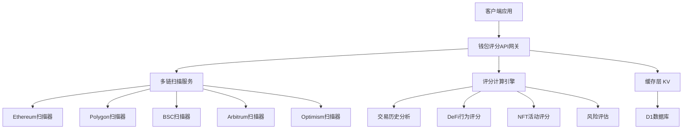

# 钱包评分系统架构设计

## 🎯 项目概述

**目标**：为Web3钱包地址提供实时信用评分，支持多链扫描，无状态服务设计

**定位**：独立微服务，可作为插件集成到多个项目中

## 🏗️ 架构设计

### 1. 技术栈选择
```
- 平台: Cloudflare Workers (无状态、全球分布)
- 语言: TypeScript
- 框架: Hono (轻量级)
- 存储: Cloudflare KV (缓存) + D1 (持久化评分历史)
- API: RESTful + GraphQL (复杂查询)
```

### 2. 系统架构图


### 3. 微服务拆分

#### 3.1 核心评分服务 (`wallet-scorer`)
```typescript
// 主要API端点
POST /api/v1/score/wallet
GET  /api/v1/score/wallet/:address
POST /api/v1/score/batch
GET  /api/v1/score/history/:address
```

#### 3.2 多链扫描服务 (`chain-scanner`)
```typescript
// 链扫描端点
GET  /api/v1/scan/:chain/:address
POST /api/v1/scan/multi-chain
GET  /api/v1/chains/supported
```

#### 3.3 评分规则引擎 (`scoring-engine`)
```typescript
// 评分规则管理
GET  /api/v1/rules
POST /api/v1/rules/custom
PUT  /api/v1/rules/:id
```

## 🔧 实现方案

### 1. 项目结构
```
wallet-scoring-system/
├── packages/
│   ├── wallet-scorer/          # 主评分服务
│   ├── chain-scanner/          # 多链扫描
│   ├── scoring-engine/         # 评分规则引擎
│   └── shared/                 # 共享工具库
├── apps/
│   ├── api-gateway/           # API网关
│   └── admin-dashboard/       # 管理后台
└── docs/                      # 文档
```

### 2. 评分维度设计

#### 2.1 基础指标 (40分)
- 钱包年龄: 0-10分
- 交易频率: 0-10分  
- 资产持有量: 0-10分
- 活跃度: 0-10分

#### 2.2 DeFi行为 (30分)
- 流动性提供: 0-10分
- 借贷记录: 0-10分
- 治理参与: 0-10分

#### 2.3 风险评估 (30分)
- 异常交易检测: -20到+10分
- 黑名单检查: -10到0分
- 合约交互安全性: 0-10分

### 3. 缓存策略
```typescript
// 缓存层级
L1: 内存缓存 (1分钟)
L2: KV缓存 (1小时) 
L3: D1数据库 (永久存储)

// 缓存键设计
wallet:score:{address}:{timestamp}
wallet:history:{address}:{page}
chain:data:{chain}:{address}:{block}
```

## 🔌 集成方式

### 1. SDK集成
```typescript
import { WalletScorer } from '@aastar/wallet-scorer'

const scorer = new WalletScorer({
  apiKey: 'your-api-key',
  endpoint: 'https://wallet-scorer.aastar.io'
})

// 实时评分
const score = await scorer.getScore('0x123...')

// 批量评分
const scores = await scorer.batchScore(['0x123...', '0x456...'])
```

### 2. API集成
```typescript
// 在waiting-list中集成
const walletScore = await fetch('https://wallet-scorer.aastar.io/api/v1/score/wallet', {
  method: 'POST',
  headers: { 'Authorization': `Bearer ${API_KEY}` },
  body: JSON.stringify({ address: walletAddress })
})
```

### 3. Webhook集成
```typescript
// 异步评分完成通知
{
  "event": "score_completed",
  "wallet": "0x123...",
  "score": 85,
  "details": { ... },
  "timestamp": "2025-09-18T12:00:00Z"
}
```

## 📊 商业模式

### 1. 免费层
- 每日100次查询
- 基础评分指标
- 7天评分历史

### 2. 付费层
- 无限查询
- 高级评分指标
- 完整历史记录
- 自定义评分规则
- 实时Webhook通知

## 🚀 开发计划

### Phase 1: MVP (4周)
- [x] 项目架构设计
- [ ] 核心评分服务开发
- [ ] Ethereum链扫描器
- [ ] 基础API端点
- [ ] 简单管理后台

### Phase 2: 多链支持 (3周)
- [ ] Polygon, BSC, Arbitrum支持
- [ ] 批量评分API
- [ ] 缓存优化
- [ ] 性能监控

### Phase 3: 高级功能 (4周)
- [ ] 自定义评分规则
- [ ] Webhook系统
- [ ] SDK开发
- [ ] 完整文档

## 🔗 与现有项目集成

### 在waiting-list中的应用
```typescript
// 注册时实时评分
const handleWalletConnect = async (address: string) => {
  const score = await getWalletScore(address)
  
  if (score < 30) {
    setShowAddMoreWallets(true) // 建议添加更多钱包
  }
  
  setWalletScore(score)
}
```

## 💡 技术创新点

1. **多链聚合评分**：首个支持全链扫描的评分系统
2. **实时计算**：利用Cloudflare Workers的边缘计算能力
3. **可插拔架构**：模块化设计，易于扩展新链
4. **智能缓存**：多层缓存减少链查询成本
5. **风险识别**：结合链上行为和黑名单数据

## 📈 扩展性考虑

- **水平扩展**：每个链扫描器可独立扩展
- **垂直扩展**：评分算法可持续优化
- **生态扩展**：支持新的DeFi协议和链
- **数据扩展**：集成更多数据源（社交、身份等）
